# GreenThumb Hub - Backend

 - use an image from AmIResponsive that shows the site on multiple devices

## Introduction

This is the backend of the project GreenThumb Hub. You can find the frontend repository [here](https://github.com/FridaWikell/greenthumb-front).

The project is about creating a social media, a hub, for all gardeners. The purpose is to show other green fingered fellows how your garden is progressing, to ask for advice and questions or just have a fun time and find new friends with the same hobby as yourself. 

## Table of Contents

## User Experience

### User Goals

The user goal is to be able to share the interest and hobby with other green fingered people. They should be able to communicate and learn from each others knowledge.

### Site Owner Goals

The site owner goal is to provide a place where the green fingers can grow and crack in bloom.

### User Stories

A total of five epics and eight user stories were created. To view all epics and user stories for the backend are collected at a project board [here](https://github.com/users/FridaWikell/projects/7).

All user stories are labeled with must have, should have, could have or won't have, depending on prioritization according to MoSCoW prioritization. Each of all user stories are also labeled with a point. The point is an estimate in how long time it will take to finish the acceptance criterias in the user story. All acceptance criterias are presented in each user story at the project board.

| Class | Points | Percentage of total points |
| ----------- | ------ | ------------ |
| Must have | 28 p | 64 % |
| Should have | 4 p | 9 % |
| Could have | 4 p | 9 % |
| Won't have | 8 p | 18 % |

#### [Epic - User authentication](https://github.com/users/FridaWikell/projects/7/views/1?pane=issue&itemId=60174807)  
As a new or returning user, I would like to securely log in or change my password, so that I can access my personalized account securely and maintain my privacy.

**User story - User login**

As a user, I would like to be able to log in to my account using my credentials, so that I can access my personalized experience on the platform.

Acceptance Criteria:

- Acceptance Criteria 1  
Given the user is at the login endpoint,  
When they submit their username and password,  
Then the system should validate the credentials and return a success response with a session token if the credentials are correct.  
- Acceptance Criteria 2  
Given a user navigates to the login endpoint,  
When they submit correct username and password,  
Then the system should validate the credentials and issue an authentication token or session.  
- Acceptance Criteria 3  
Given a user navigates to the login endpoint,  
When they submit incorrect username or password,  
Then the system should deny access and provide an error message stating incorrect credentials.  

**User Story - User password change**

As a registered user, I would like to change my password, so that I can ensure my account's security.

Acceptance Criteria:

- Acceptance Criteria 1  
Given the user is logged in and at the password change endpoint,  
When they submit their old password along with a new password,  
Then the system should verify the old password, change to the new password, and return a success message.  
- Acceptance Criteria 2  
Given a user is logged in and navigates to the password change endpoint,  
When they submit the correct current password and a valid new password,  
Then the system should update the password and confirm the change to the user.  
- Acceptance Criteria 3  
Given a user is logged in and navigates to the password change endpoint,  
When they submit an incorrect current password or invalid new password,  
Then the system should deny the change and display an error message.  

#### [Epic - User profile management](https://github.com/users/FridaWikell/projects/7/views/1?pane=issue&itemId=60175794)  
As a registered user, I would like to update my profile information including my profile image and username, so that my profile reflects my current preferences and identity.

**User story - Update profile image**

As a registered user, I would like to update my profile image, so that I can keep my profile up-to-date.

Acceptance Criteria:

- Acceptance Criteria 1  
Given the user is logged in and at the update profile image endpoint,  
When they upload a new image file,  
Then the system should replace the old image with the new one and return a success message.  

**User Story - Update username**

As a registered user, I would like to change my username, so that I can update my identity on the platform.

Acceptance Criteria:

- Acceptance Criteria 1  
Given the user is logged in and at the update username endpoint,  
When they input a new username,  
Then the system should update the username  

#### [Epic - Content management](https://github.com/users/FridaWikell/projects/7/views/1?pane=issue&itemId=60177794)  
As a user, I would like to publish and manage posts with text and images, so that I can share and express my thoughts, experiences, and creative content with the community.

**User Story - Publish posts with images**

As a user, I would like to publish posts with images, so that I can share content with others.

Acceptance Criteria:

- Acceptance Criteria 1  
Given the user is logged in and at the post creation endpoint,  
When they submit a post along with image,  
Then the system should save the post and images and publish it to the page.  
- Acceptance Criteria 2  
Given an image file is too large or of an unsupported format,  
When the user attempts to attach it with the post,  
Then the system should reject the file and provide an error message detailing file size or format restrictions.  

#### [Epic - Social interaction](https://github.com/users/FridaWikell/projects/7/views/1?pane=issue&itemId=60178790)  
As a user, I would like to interact with other users' content through likes and follow their profiles, so that I can engage with the community and stay updated on content from users I am interested in.

**User Story - Like posts**

As a user, I would like to like posts made by others, so that I can engage with content that I find appealing.

Acceptance Criteria:

- Acceptance Criteria 1  
Given the user is logged in and views a post,  
When they click the like button,  
Then the system should increment the like count for the post.  
- Acceptance Criteria 2  
Given a user has already liked a post,  
When they attempt to like the same post again,  
Then the system should not increment the like count.  

**User Story - Follow users**

As a user, I would like to follow other users, so that I can keep up with their posts and activities on the platform.

Acceptance Criteria:

- Acceptance Criteria 1  
Given the user is logged in and at another user's profile,  
When they click the follow button,  
Then the system should add that user to their following list.  
- Acceptance Criteria 2  
Given a user is already following another user,  
When they click the unfollow button,  
Then the system should remove that user to their following list.  

#### [Epic - Participation in polls](https://github.com/users/FridaWikell/projects/7/views/1?pane=issue&itemId=60180110)  
As a user, I would like to participate in polls, so that I can express my opinions and engage with interactive content on the platform.

**User Story - Participate in polls**

As a user, I would like to participate in polls, so that I can express my opinion on different topics.

Acceptance Criteria:

- Acceptance Criteria 1  
Given the user is logged in and at the poll participation endpoint,  
When they select an option and submit their choice,  
Then the system should record their response.  

## Design

### Entity-Relationship Diagram - ERD

The ERD’s for the project is presented below.

**Answer class**

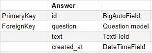

**Comment class**

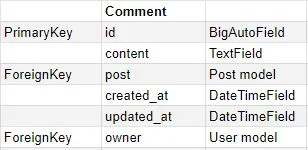

**Follower class**

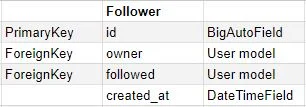

**Like class**

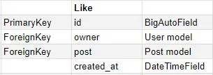

**Post class**

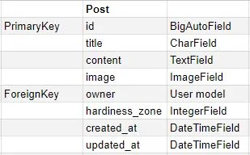

**Profile class**

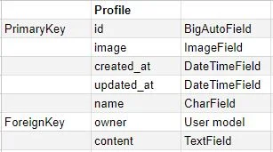

**Question class**

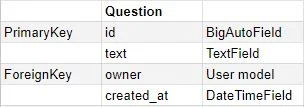

**Vote class**

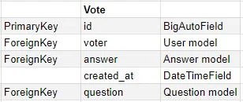

## Testing

### Validation of Code

All code files are validated in [CI Python Linter](https://pep8ci.herokuapp.com/#) to meet the PEP8 standards. All files got the "All clear, no errors found" except for the settings.py file. Four errors are left unfixed since the first of "AUTH_PASSWORD_VALIDATORS" wasn't under 79 characters, even if 'NAME' and 'django.contrib.auth.password_validation.UserAttributeSimilarityValidator' were on separate lines. The rest of the values in "AUTH_PASSWORD_VALIDATORS" were left unfixed to follow the same pattern as the first value pair. 

All code files (except settings.py) got "All clear, no errors found" message.

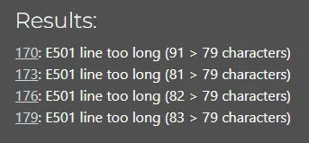

Four errors were left unfixed in settings.py.

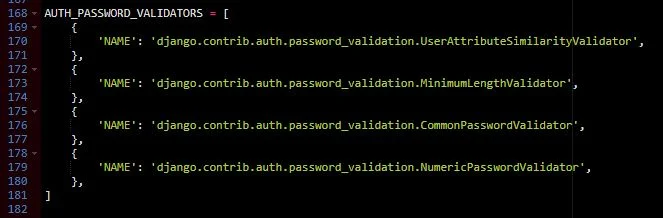

The source to the errors left unfixed in settings.py.

### Automated Testing

A total of 34 tests were written for all apps. Below, the sum for each app is presented and linked to each app.

[Comments](https://github.com/FridaWikell/greenthumb-backend/blob/main/comments/tests.py)

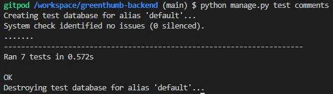

[Followers](https://github.com/FridaWikell/greenthumb-backend/blob/main/followers/tests.py)

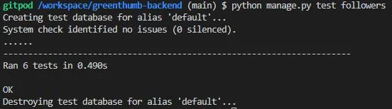

[Likes](https://github.com/FridaWikell/greenthumb-backend/blob/main/likes/tests.py)

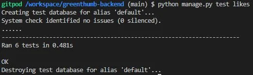

[Polls](https://github.com/FridaWikell/greenthumb-backend/blob/main/polls/tests.py)

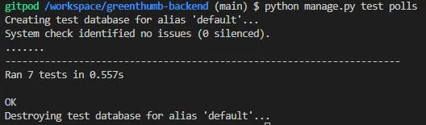

[Posts](https://github.com/FridaWikell/greenthumb-backend/blob/main/posts/tests.py)

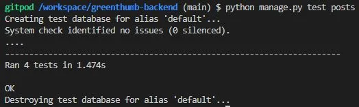

[Profiles](https://github.com/FridaWikell/greenthumb-backend/blob/main/profiles/tests.py)

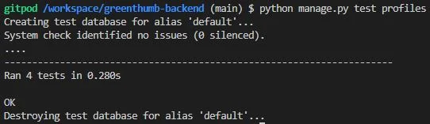

### Manual Testing

| Feature being tested | Expected Outcome | Testing Performed | Actual Outcome | Result (Pass or fail) |
| -------------------- | ---------------- | ----------------- | -------------- | --------------------- |
| Sign up | New user gets signed up | Enter requested information in sign up form | 
| Sign up with same username | User can’t sign up when they try username already in use | Try to sign up with a username already in use | 
| Log in | User gets logged in with correct user credentials | Enter valid user information | enter details here | enter details here |
| Password change | Password updates when the same password is entered twice | Enter new password and confirm the password in change password form |
| Password change - fail | Password doesn’t updates if you don’t write the same password twice in change password form |

| Feature being tested | Expected Outcome | Testing Performed | Actual Outcome | Result (Pass or fail) |
| -------------------- | ---------------- | ----------------- | -------------- | --------------------- |
| Change profile image | The profile image changed at all places when save is pressed | Change profile image, check profile image at all places |
| Update username | The username is changed at all places when save is pressed | Change username, check username at all places |
| Update username - fail | Username doesn’t update when the user tries to update to a username already in use | Try to update username to an username already in use |
| Update username - warning | The user gets a warning that the username they try to change to already is in use | Try to update username to an username already in use |

| Feature being tested | Expected Outcome | Testing Performed | Actual Outcome | Result (Pass or fail) |
| -------------------- | ---------------- | ----------------- | -------------- | --------------------- |
| Upload a post with an image | The post is submitted when an image, text and content is applied | Add a post with image, title and content | 
| Upload a post without an image | The post is submitted when text and content is applied | Add a post with title and content |
| Error message for large images | When an image over 2 MB is uploaded, an error message is shown | Upload a large image, over 2 MB in size | 
| Change image before creating post | When an image is uploaded, the user can change the image and upload a new image before submitting the post | Upload an image, change image and upload a new |

| Feature being tested | Expected Outcome | Testing Performed | Actual Outcome | Result (Pass or fail) |
| -------------------- | ---------------- | ----------------- | -------------- | --------------------- |
| Like post | When the like button is pressed, a like is registered and the number of likes increases by one | Find a post, press like button | 
| Unlike post | When the like button at an already liked post is pressed, the like is taken back and the number of likes decreases by one | Find a already liked post, press like button |
| Follow user | When the follow button is pressed, the user is followed and its post is visible in “plant friends” | Find a user, press follow and view to be sure its posts are visible in plant friends | 
| Follow user - button change | When the follow button is pressed, it changes to become an unfollow button | Find a user, press follow and watch the button content change |
| Unfollow user | When the unfollow button is pressed, the user is unfollowed and its post isn’t visible in “plant friends” | Find a user, press unfollow and view to be sure its posts aren’t visible in plant friends | 
| Unfollow user - button change | When the unfollow button is pressed, it changes to become a follow button | Find a user, press unfollow and watch the button content change |

| Feature being tested | Expected Outcome | Testing Performed | Actual Outcome | Result (Pass or fail) |
| -------------------- | ---------------- | ----------------- | -------------- | --------------------- |
| Post a question | When question and answers are filled out and submit button is pressed, the questions is posted | Write a question, add answers, press submit | 
| Delete a question | When the user is logged in, they can delete they own questions | Press delete at their own question | 
| View votes | View number of votes at each answer | Press view result | 

### Bugs

When all code files were validated in the Python Linter to meet PEP8 standards, just over 100 errors were discovered. The five most common were:

- No newline at end of file 
- Blank line contains whitespace
- Too many blank lines
- Expected 2 blank lines, found 1
- Line too long

The most common error was "Line too long".

These error were corrected and all files (except the settings file, see [Validation of Code](#validation-of-code)) resulted without any errors.

## Technologies Used

The repository is created from [Code Institutes Gitpod full template](https://github.com/Code-Institute-Org/gitpod-full-template) through [GitHub](https://github.com/). All code is written in [Gitpod](https://www.gitpod.io/) and deployed at [Heroku](https://www.heroku.com). The code language used is [Python](https://www.python.org/) with Django framework. To build RESTful APIs, Django REST is used. 

For the ERD's, [Google Spreadsheet](https://spreadsheets.google.com/) is used. To convert the screenshots to webp file format, [Pixelied](https://pixelied.com/convert/jpg-converter/jpg-to-webp) is used.

### Packages used

| Name | Used for |
| -------------- | ------------ |
| asgiref | Package for ASGI (Asynchronous Server Gateway Interface) applications, enabling asynchronous programming features in Django |
| cloudinary | Integrates with the Cloudinary service to manage application media assets in the cloud. |
| dj-database-url | Allows Django projects to utilize database URLs for configuration. |
| dj-rest-auth | Provides a set of REST API endpoints for handling authentication tasks in a Django project. |
| Django | A Python web framework for rapid development and clean, pragmatic design. |
| django-allauth | Adds authentication, registration, and account management capabilities to Django projects. |
| django-cloudinary-storage | A Django storage backend that integrates with Cloudinary for handling static and media assets. |
| django-cors-headers | Middleware for Django to handle Cross-Origin Resource Sharing (CORS), allowing web applications to safely make cross-domain requests. |
| django-filter | A convenient way to add filtering capability to Django web applications. |
| djangorestframework | A toolkit for building Web APIs in Django. |
| djangorestframework-simplejwt | A JSON Web Token authentication plugin for the Django REST Framework. |
| gunicorn | A WSGI HTTP server for UNIX systems, serving Python web applications concurrently. |
| oauthlib | A implementation of OAuth for sharing secure access to resources without sharing passwords. |
| Pillow | The Python Imaging Library adds image processing capabilities to the Python interpreter. |
| psycopg2 | A PostgreSQL database adapter for Python, facilitating interaction between Python applications and PostgreSQL databases. |
| PyJWT | A Python library for encoding and decoding JSON Web Tokens. |
| python3-openid | A set of Python libraries to support using OpenID. |
| pytz | Provides timezone definitions for Python, helping to handle datetime objects aware of time zones. |
| requests-oauthlib | Combines the Requests library with OAuthlib for OAuth1 and OAuth2 sessions. |
| sqlparse | A non-validating SQL parser module for Python, used to format or decompose SQL queries. |

Detail what technologies you used. So what code languages, what frameworks, libraries, what software did you use to develop the site - Balsamic for your wireframes, Figma for a mockup?

## Deployment

### Fork repository in GitHub

- Open the chosen repository in GitHub
- Click on the "Fork" button
- A copy of the repository is now located in your own account

### Clone repository in GitHub

- Open the chosen repository in GitHub
- Click on "Code" button
- Copy the URL
- Open your command line interface
- Navigate to the directory you want to clone the repository to
- Use 'git clone', followed by the earlier copied URL
- Move into the newly created directory
- Install the dependencies using 'pip install -r requirements.txt'
- Run the application with 'python manage.py runserver'

### Deployment to Heroku

- Open Heroku and log in
- Click on "New" and choose the option "Create new app"
- Choose an app name and which region (Europe or United States) you are located in
- Press "Create app"
- When the app is created, choose the Settings tab
- Under "Config Vars", press "Reveal Config Vars"
- In key, write ALLOWED_HOST
- In value, insert the url to the created app (without https://)
- Press "Add"
- In key, write CLOUDINARY_URL
- In value, insert the url to the cloudinary database
- Press "Add"
- In key, write DATABASE_URL
- In value, insert the url to the database
- Press "Add"
- In key, write SECRET_KEY
- In value, insert the secret key from the Django settings
- Press "Add"
- Under "Buildpacks", press "Add buildpack"
- Choose "Python", press "Add buildpack"
- Change tab to the Deploy tab
- Choose deploy method - GitHub
- Search for the correct repository name at your connected GitHub account
- Press "Connect"
- Under "Manual deploy", choose which branch to deploy and press "Deploy Branch"

Link to deployed website: https://greenthumb-back-4bd145d8f205.herokuapp.com/

## Credits

The project is based at [drf-api from Code Institute](https://github.com/Code-Institute-Solutions/drf-api). The comments app, followers app, likes app, posts app, and profiles app are based but in some cases modified from the mentioned project above.

To get more knowledge, the [Django documentation](https://docs.djangoproject.com/en/5.0/) and [Testing in Django](https://docs.djangoproject.com/en/5.0/topics/testing/) was used.

## Acknowledgements
Any special acknowledgements you'd like to leave

[Back to top](#greenthumb-hub---backend)
